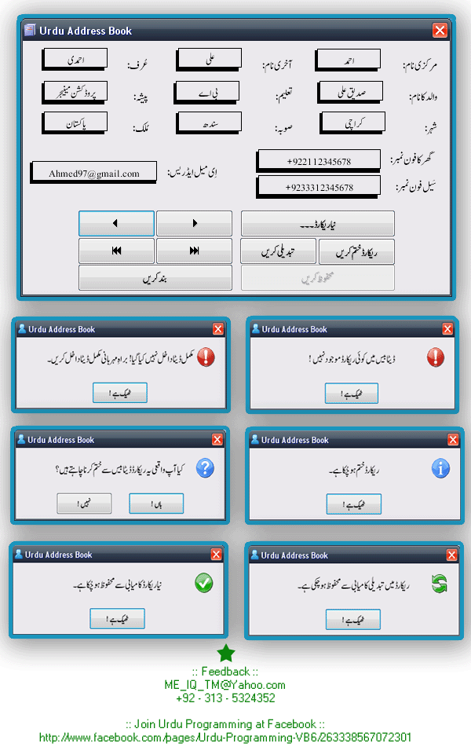



## Urdu Address Book  V1\.5 \(Last Update 19\-02\-2012\)

### Description

Pre-Requirements : Pak Urdu Installer

 http://www.mbilalm.com/download/ 

 World's first open source Urdu Database Management System (DBMS) sample in VB6, in form of an Urdu Address Book. First time uploaded at world's largest open source coding website, The PlanetSourceCode.Com. After a long time efforts, i'm succeeded to make this DBMS front end. I hope it will be a great thing for new programmers & also for those open source programmers who are trying to make an Urdu script like Database Management System. 

 In this Address Book, i 've fully tried to make a full functional Urdu Database System front end, like other language's databases, to clear the concepts of programmers that how to make DBMS front ends of Urdu Script like languages (Arabic,Persian,Punjabi etc). You can use this code concept to make any language's Database Management System like Chines, Thai, Italian or any language you choose. I think, any beginner can understand the code used in the project.

If anyone of you, wants to be some help or facing problems during use of code or feeling difficulty to understand, Contact me at my email address. I'll fully try to help you as i can. Please comment & rate globes for this code, if you like that effort. Thank You. 

 Join Urdu Programming at Facebook 

 http://www.facebook.com/pages/Urdu-Programming-VB6/263338567072301 
 
### More Info
 

             |
---                |---
**Submitted On**   |2012-02-18 20:07:50
**By**             |[Mehmood Iqbal](https://github.com/Planet-Source-Code/PSCIndex/blob/master/ByAuthor/mehmood-iqbal.md)
**Level**          |Intermediate
**User Rating**    |5.0 (35 globes from 7 users)
**Compatibility**  |VB 6\.0
**Category**       |[Databases/ Data Access/ DAO/ ADO](https://github.com/Planet-Source-Code/PSCIndex/blob/master/ByCategory/databases-data-access-dao-ado__1-6.md)
**World**          |[Visual Basic](https://github.com/Planet-Source-Code/PSCIndex/blob/master/ByWorld/visual-basic.md)
**Archive File**   |[Urdu\_Addre2220242192012\.zip](https://github.com/Planet-Source-Code/mehmood-iqbal-urdu-address-book-v1-5-last-update-19-02-2012__1-73829/archive/master.zip)

